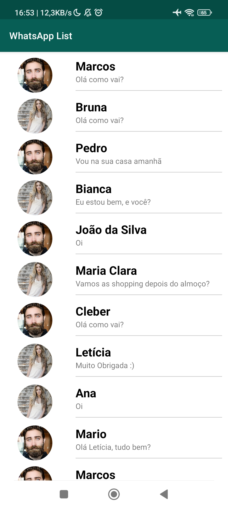
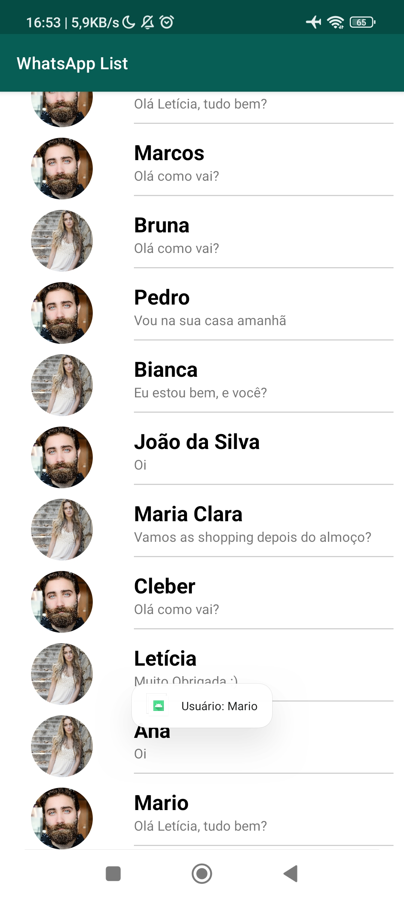

# WhatsApp List 📱💬

O WhatsApp List é um aplicativo Android em Java que permite ao usuário listar contatos do WhatsApp e exibir as informações básicas de cada contato, como a foto de perfil, nome e a ultima mensagem. Ao clicar no usuario também é exibida uma Toast com o nome do usuário.

    
    

##

O aplicativo utiliza vários conceitos do desenvolvimento Android, incluindo:

## 🧰 Funcionalidades

### RecyclerView

O RecyclerView é utilizado para criar listas de elementos que podem ser rolados verticalmente. Ele é uma versão mais eficiente e flexível do ListView e é muito utilizado em aplicativos Android.

### LayoutManager

O LayoutManager é responsável por determinar a aparência da RecyclerView. Ele define como os elementos da lista são dispostos na tela.

### Adapter

O Adapter é utilizado para fornecer os dados necessários para preencher a RecyclerView. Ele cria e gerencia os elementos da lista e é responsável por atualizá-los conforme necessário.

### Dataset (item de lista)

O Dataset é o conjunto de dados que é exibido na RecyclerView. Ele geralmente é representado como uma lista de objetos e contém as informações necessárias para preencher cada elemento da lista.

### CircleImageView

O CircleImageView é utilizado para exibir a foto de perfil de cada contato em um formato circular.

### RecyclerItemClickListener - Eventos de clique em itens da RecyclerView

O RecyclerItemClickListener é utilizado para detectar quando o usuário clica em um item da RecyclerView. Ele permite que o aplicativo execute uma ação específica quando o usuário interage com um item da lista.
